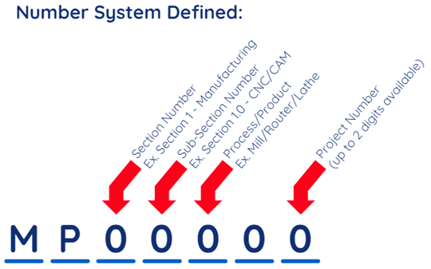

:::info UTE Middle School Projects General Info

Unique to Texas Projects (UTE-Projects) are events that are unique to the state of Texas and can be competed at the regional and state level.

Projects can be completed either individually or as a team. When registering the project for the Regional Competition, the project will be registered to one student of a team.

Regions may enter up to 7 projects for each UTE-Project event.

If students **only** have events in this category, they may register as a virtual competitor and attendance is not required.

Students are responsible for reviewing and following the general rules and guidelines established in the:

General Rules and Regulations

- Copyright Policy
- Student Uniqueness of Work Policy
- Required Documentation

These rules and requirements may be modified at the regional levels to accommodate for space and time constraints, check with your region for more details.

**Important**: Ignorance of the rules and/or misunderstanding of the rules as run at the state conference is not an excuse for a protest or additional consideration.

:::
